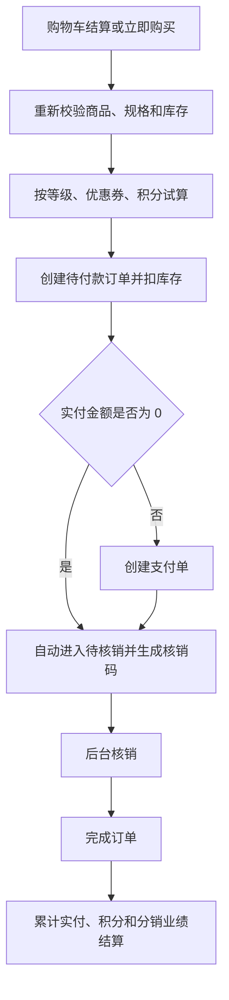
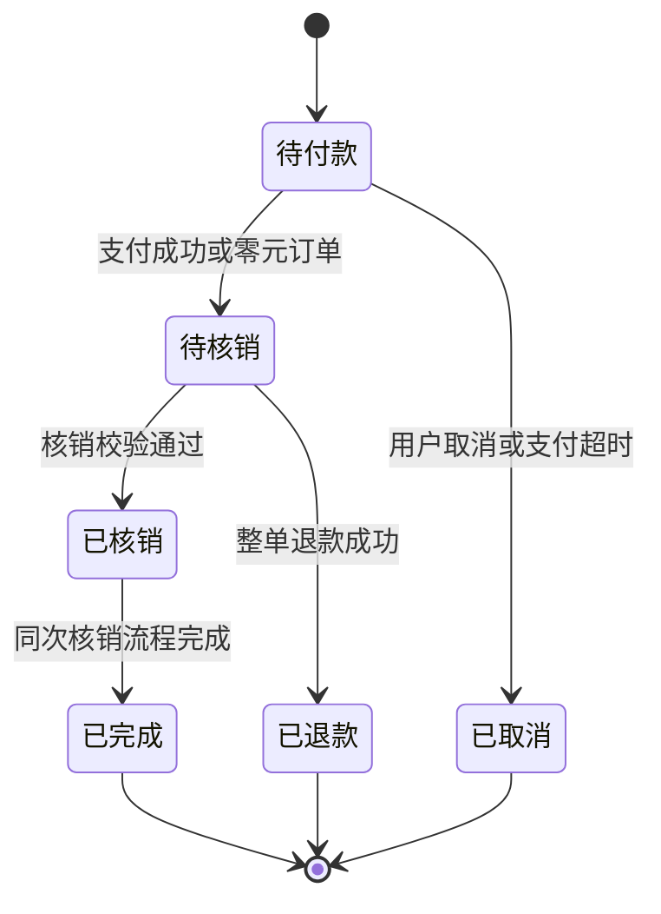

# 订单模块产品设计说明

> 模块状态：服务端与 B 端已实现；C 端订单页面待接入

## 1. 模块定位、目标与非目标

订单模块承接普通购买和拼团购买，将商品、会员权益、库存、支付、核销和退款串成完整交易生命周期。

目标：

- 订单创建前提供可信的服务端试算结果。
- 创建订单时冻结当次商品与权益结果并扣减库存。
- 通过明确状态控制支付、取消、核销和退款。
- 为后台提供查询、详情、核销和导出能力。

非目标：

- 支付渠道和退款执行结果归[支付模块](./05-payment.md)。
- 会员折扣、优惠券和积分规则归[营销模块](./06-marketing.md)。
- 不支持部分退款、已核销后退款、订单改价、拆单或售后协商流程。

## 2. 用户角色、场景与端侧范围

| 角色         | 使用场景                       | 当前支持                   |
| ------------ | ------------------------------ | -------------------------- |
| 会员         | 试算、创建、查看和取消本人订单 | 能力已实现，C 端页面待接入 |
| 核销人员     | 按订单或核销码完成到店核销     | B 端已实现                 |
| 订单运营人员 | 查询订单、查看详情和导出       | B 端已实现                 |
| 退款人员     | 对待核销订单发起整单退款       | B 端已实现                 |

## 3. 核心业务对象与术语

- **订单**：一次购买交易的主记录，保存会员、金额、状态、联系人和关键时间。
- **订单明细**：下单时保存的商品、规格、单价、数量和小计快照。
- **订单试算**：在不创建订单的前提下计算商品金额、权益优惠和实付金额。
- **核销码**：支付成功后生成的 8 位数字凭证，用于到店服务核销。
- **普通订单**：可使用会员等级、优惠券和积分的购物订单。
- **拼团订单**：由拼团模块创建的单规格、单数量、固定拼团价订单。

## 4. 功能清单

### 4.1 C 端

- 从购物车选中项或立即购买明细发起订单试算。
- 查询当前商品组合可用的优惠券。
- 提交联系人、手机号、备注、一张会员券和计划使用积分。
- 创建订单并获得订单详情和最终金额。
- 按状态分页查看本人订单。
- 查看本人订单详情、商品快照、优惠明细和核销信息。
- 取消本人待付款订单。

### 4.2 B 端

- 按订单号、联系人手机号、会员昵称或会员手机号搜索。
- 按订单状态或指定会员筛选。
- 查看订单商品、会员、联系人、金额拆分、支付时间、核销码和备注。
- 通过订单详情或核销码执行核销。
- 对待核销订单发起整单退款。
- 按当前筛选条件导出订单。

## 5. 关键用户流程

### 5.1 普通订单创建与履约

### 5.2 取消与退款

- 待付款订单可由会员主动取消，也可在支付超时后由系统自动取消。
- 取消后回补库存、返还已扣积分，并释放仍有效的优惠券。
- 已付款待核销订单不能取消，但可由有权限人员发起整单退款。
- 退款成功后回补库存、回退销量、返还订单权益，并通知拼团和分销模块处理关联记录。
- 已核销或已完成订单不能退款。

## 6. 业务规则与状态

### 6.1 订单状态机

| 状态   | 含义                             | 允许动作                     |
| ------ | -------------------------------- | ---------------------------- |
| 待付款 | 订单已创建、库存已扣减，尚未付款 | 支付、会员取消、系统超时取消 |
| 待核销 | 已支付并生成核销码，等待到店服务 | 核销、整单退款               |
| 已核销 | 服务已核销的内部过渡状态         | 自动进入已完成               |
| 已完成 | 核销结束，权益和业绩已完成结算   | 只读                         |
| 已取消 | 未支付订单终止，库存与权益已释放 | 只读                         |
| 已退款 | 待核销订单已完成整单退款         | 只读                         |

当前核销动作会在同一业务处理中依次完成“已核销”和“已完成”，正常情况下最终展示为已完成。

### 6.2 创建与金额规则

- 订单必须来自本人有效购物车项或明确的立即购买规格和数量。
- 每项购买数量为 1–99，创建时重新读取商品状态、规格状态、价格和库存。
- 普通订单计价顺序固定为商品金额、会员等级折扣、一张优惠券、积分抵扣、实付。
- 端侧不能提交或覆盖订单最终金额。
- 订单保存下单时的商品名称、图片、规格、单价和权益结果，后续商品或规则修改不改变历史订单。
- 创建成功立即扣减规格库存；支付成功后增加商品销量。
- 实付金额为 0 的订单无需支付，直接进入待核销并生成核销码。

### 6.3 超时与核销规则

- 待付款订单默认超过 30 分钟自动取消，实际时长可由运行配置调整。
- 支付成功后生成唯一的 8 位数字核销码。
- 只有待核销订单可以核销。
- 核销成功记录核销时间与后台操作人，并立即完成订单。
- 完成订单后发放积分、累计会员实付，并计入有效分销业绩。

### 6.4 拼团订单规则

- 拼团订单固定购买一个指定规格，数量为 1，使用活动拼团价。
- 拼团订单不使用会员等级折扣、优惠券或积分。
- 其支付、取消、核销和退款仍复用本模块状态机。

## 7. 权限与数据可见范围

- C 端会员只能查询、取消和支付本人订单；访问他人订单时按订单不存在处理。
- B 端列表、核销、导出和退款分别受权限控制。
- 核销人员身份记录为后台用户，不与会员身份混用。
- 核销码属于履约凭证，不应在无授权场景公开展示。

## 8. 异常与边界场景

| 场景                       | 处理                             |
| -------------------------- | -------------------------------- |
| 未选择商品或购物车为空     | 拒绝试算或创建，提示选择结算商品 |
| 商品、规格下架或库存不足   | 拒绝创建并提示具体原因           |
| 购物车项不属于当前会员     | 按购物车项不存在处理             |
| 试算后价格、库存或权益变化 | 创建时重新计算，以创建结果为准   |
| 对非待付款订单取消         | 拒绝并提示当前状态不可操作       |
| 使用无效核销码             | 提示核销码无效                   |
| 重复核销                   | 拒绝并提示当前状态不可操作       |
| 已核销订单申请退款         | 拒绝退款                         |
| 同一购物车被并发结算       | 仅首个有效请求成功，避免重复下单 |

## 9. 模块联动

- [商品模块](./02-product.md)提供可售规格、价格、库存及销量维护。
- [购物车模块](./03-cart.md)提供本人待结算项目，并在下单成功后移除。
- [营销模块](./06-marketing.md)提供订单试算、权益锁定、返还和完成结算。
- [支付模块](./05-payment.md)推进待付款到待核销或待核销到已退款。
- [拼团模块](./09-group-buy.md)创建特殊订单并监听订单结果。
- [分销模块](./10-distribution.md)在支付、核销和退款后生成、确认或冲销佣金与业绩。

## 10. 当前覆盖与已知缺口

| 能力                                 | 服务端 | B 端         | C 端               |
| ------------------------------------ | ------ | ------------ | ------------------ |
| 试算、可用券、创建、列表、详情、取消 | 已实现 | 详情可查看   | 页面待接入         |
| 超时取消和库存回补                   | 已实现 | 无需人工页面 | 待联调验证         |
| 核销和导出                           | 已实现 | 已接入       | 核销结果待展示     |
| 整单退款入口                         | 已实现 | 已接入       | 无会员自助退款入口 |

已知缺口：小程序确认订单、我的订单、订单详情和支付结果页仍为占位；现有小程序订单请求定义也需要按当前业务能力统一对齐。

## 11. 验收标准

- **Given** 商品有效且库存充足，**When** 会员从购物车创建订单，**Then** 保存商品与权益快照、扣减库存并移除已结算购物车项。
- **Given** 订单实付为 0，**When** 创建成功，**Then** 无需支付并直接进入待核销状态。
- **Given** 待付款订单超过配置时限，**When** 超时任务处理，**Then** 订单取消且库存、积分和有效优惠券恢复。
- **Given** 待核销订单和有效核销码，**When** 有权限人员核销，**Then** 记录核销人与时间并完成订单。
- **Given** 已核销或已完成订单，**When** 发起退款，**Then** 操作被拒绝且订单状态不变。
