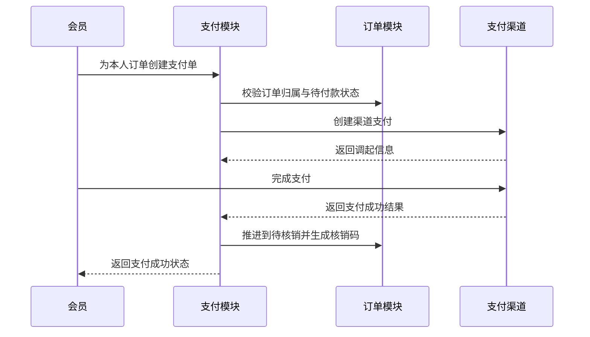

# 支付模块产品设计说明

> 模块状态：模拟支付与退款闭环已实现；真实微信支付和 C 端页面待接入

## 1. 模块定位、目标与非目标

支付模块为订单提供统一的支付单创建、状态查询、支付确认和整单退款能力，并把可靠结果同步到订单及下游业务。

目标：

- 同一订单只形成一张有效支付单，重复创建时安全复用。
- 支付成功只推进一次订单状态。
- 退款仅针对符合条件的订单，并保持支付、退款和订单结果一致。
- 开发环境可使用模拟支付完成端到端联调。

非目标：

- 不负责订单计价、库存和订单状态规则，相关规则以[订单模块](./04-order.md)为准。
- 当前不支持部分退款、多次退款、会员自助退款或线下补录支付。
- 真实微信支付签名、回调和商户配置尚未落地。

## 2. 用户角色、场景与端侧范围

| 角色          | 使用场景                                 | 当前支持                   |
| ------------- | ---------------------------------------- | -------------------------- |
| 会员          | 为本人待付款订单创建支付单、查询支付结果 | 能力已实现，C 端页面待接入 |
| 开发/测试人员 | 在非生产环境确认模拟支付成功             | 已实现                     |
| 退款人员      | 查询订单支付信息并发起整单退款           | B 端订单页已实现           |

## 3. 核心业务对象与术语

- **支付单**：订单对应的支付记录，包含支付流水号、金额、渠道、状态和支付时间。
- **支付渠道**：当前支持模拟渠道；微信渠道保留但尚未完成配置。
- **渠道流水号**：支付渠道返回的唯一交易标识。
- **退款单**：一次整单退款记录，包含退款流水号、金额、原因、状态和退款时间。
- **模拟支付**：仅用于非生产环境联调的支付确认方式。

## 4. 功能清单

### 4.1 C 端

- 为本人待付款订单创建或复用支付单。
- 获取支付流水号、订单、金额、渠道、状态和渠道调起信息。
- 查询本人支付单和渠道侧支付状态。
- 在非生产环境执行模拟支付成功确认。

### 4.2 B 端

- 从订单查看对应支付单。
- 对已支付待核销订单发起整单退款并填写退款原因。
- 当前没有独立的支付单或退款单管理列表。

## 5. 关键用户流程

### 5.1 支付

当前真实渠道流程尚未接通；非生产环境通过模拟确认代替渠道支付与回调。

### 5.2 整单退款

1. 有权限人员从订单详情发起退款并填写原因。
2. 系统确认支付单成功且订单仍为待核销。
3. 创建或复用该订单的退款记录，并向当前支付渠道发起全额退款。
4. 渠道退款成功后，支付单转为已退款，退款单转为成功，订单转为已退款。
5. 订单模块回补库存、回退销量和返还权益；拼团与分销模块处理关联冲销。

## 6. 业务规则与状态

### 6.1 支付规则

- 一个订单最多对应一张有效支付单。
- 只有订单所属会员可创建或查询该支付单。
- 只有待付款且实付大于 0 的订单需要支付单；零元订单由订单模块直接推进。
- 支付金额取订单最终实付金额，会员或端侧不能修改。
- 重复创建支付单返回原支付单，不重复生成渠道交易。
- 重复支付成功确认不重复推进订单、增加销量或使用权益。
- 生产环境禁止模拟支付确认。

### 6.2 支付单状态

| 状态   | 含义                         | 后续动作                 |
| ------ | ---------------------------- | ------------------------ |
| 待支付 | 支付单已创建，尚未确认成功   | 查询、支付确认           |
| 成功   | 支付已确认，订单已进入待核销 | 可按规则整单退款         |
| 失败   | 支付渠道确认失败             | 当前没有后台人工重置入口 |
| 已退款 | 整单退款成功                 | 终态                     |

### 6.3 退款规则

- 仅支付成功且订单仍为待核销时允许退款。
- 每个订单最多保留一张有效退款单。
- 退款金额固定等于该支付单全额，不支持部分退款。
- 退款原因必填，最长 255 个字符。
- 已成功退款的请求再次提交时返回原结果，不重复退款。

### 6.4 退款单状态

| 状态   | 含义                             |
| ------ | -------------------------------- |
| 处理中 | 已创建退款请求，等待渠道结果     |
| 成功   | 渠道退款成功且订单已完成退款处理 |
| 失败   | 渠道退款失败，需要进入异常待办   |

## 7. 权限与数据可见范围

- C 端会员只能创建、查询和模拟确认本人的支付单。
- B 端查询支付信息随订单查看权限控制，退款使用独立退款权限。
- 渠道流水号和支付状态属于交易信息，不向无权限角色开放。
- 模拟支付在生产环境始终不可用。

## 8. 异常与边界场景

| 场景                                 | 处理                                     |
| ------------------------------------ | ---------------------------------------- |
| 订单不属于当前会员                   | 按支付单或订单不存在处理                 |
| 订单已支付、取消或退款后再创建支付单 | 若无可复用支付单则拒绝，提示订单不可支付 |
| 支付成功结果重复到达                 | 返回已有成功结果，不重复执行业务         |
| 支付单非待支付状态执行模拟确认       | 拒绝操作                                 |
| 微信支付未配置                       | 明确提示微信支付尚未配置                 |
| 待核销之外的订单退款                 | 拒绝并说明仅待核销订单可退               |
| 渠道退款失败                         | 退款不推进成功状态，进入退款异常待办     |
| 已成功退款再次申请                   | 返回原退款结果，不重复向渠道发起         |

## 9. 模块联动

- [订单模块](./04-order.md)提供支付前置状态，并接收支付成功与退款成功结果。
- [营销模块](./06-marketing.md)在支付成功时使用会员券，在退款时返还权益。
- [拼团模块](./09-group-buy.md)根据支付成功决定成团人数，根据退款结果更新参团状态。
- [分销模块](./10-distribution.md)根据支付、核销和退款结果生成、确认或冲销佣金。
- [经营看板](./11-dashboard.md)把失败或超时退款纳入后台待办。

## 10. 当前覆盖与已知缺口

| 能力                   | 服务端           | B 端         | C 端             |
| ---------------------- | ---------------- | ------------ | ---------------- |
| 支付单创建、复用、查询 | 已实现           | 可按订单查看 | 页面待接入       |
| 模拟支付确认           | 已实现，仅非生产 | 无需后台入口 | 支付结果页待接入 |
| 整单退款               | 已实现           | 订单页已接入 | 无会员自助入口   |
| 微信支付               | 仅保留渠道位置   | 无配置页面   | 未接入           |

已知缺口：真实微信支付创建、签名、回调验签、状态同步、退款和 UAT 尚未实现；小程序支付请求定义与支付结果页也需统一接入当前支付流程。

## 11. 验收标准

- **Given** 本人待付款订单，**When** 连续两次创建支付单，**Then** 返回同一支付单且金额一致。
- **Given** 非生产环境的待支付支付单，**When** 模拟确认成功，**Then** 支付单成功、订单进入待核销并生成核销码。
- **Given** 同一成功结果重复到达，**When** 再次处理，**Then** 不重复增加销量、使用权益或生成下游记录。
- **Given** 已支付待核销订单，**When** 有权限人员整单退款成功，**Then** 支付单、退款单和订单状态保持一致。
- **Given** 已核销订单，**When** 发起退款，**Then** 系统拒绝且不创建成功退款结果。
