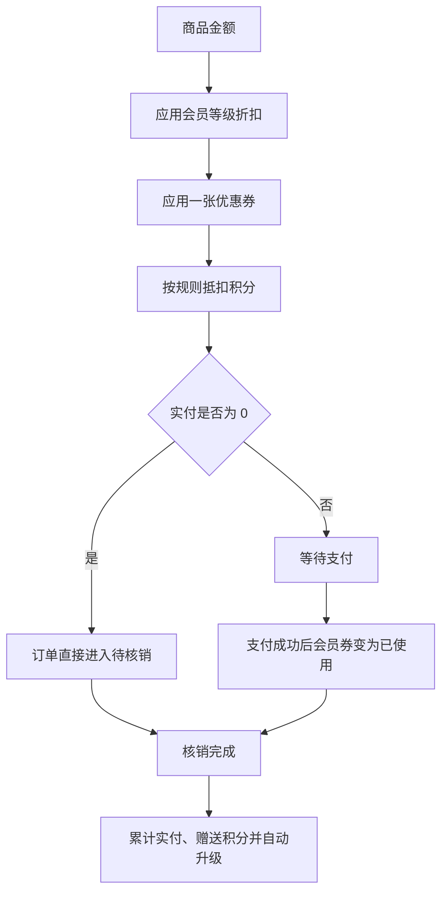

# 营销模块产品设计说明

> 模块状态：服务端与 B 端已实现；C 端权益能力已实现，小程序页面待接入

## 1. 模块定位、目标与非目标

营销模块统一管理会员等级、积分与优惠券，并按固定顺序参与普通订单试算和权益结算。

目标：

- 根据会员累计完成实付自动匹配会员等级。
- 支持积分获得、抵扣、返还和可追溯流水。
- 支持满减券、折扣券和固定规格兑换券。
- 在订单创建、支付、取消、退款和完成时正确锁定、使用、返还或发放权益。

非目标：

- 不支持多券叠加、部分退款、人工调分或人工直接改等级。
- 拼团订单不叠加会员折扣、优惠券或积分。
- 积分商城、大转盘、限时折扣和兑换码不属于当前基线。

## 2. 用户角色、场景与端侧范围

| 角色          | 使用场景                                                     | 当前支持                   |
| ------------- | ------------------------------------------------------------ | -------------------------- |
| 会员          | 查看等级与积分、查看积分流水、领券、查看我的券、下单使用权益 | 能力已实现，C 端页面待接入 |
| 营销运营人员  | 配置等级、积分规则、优惠券模板和定向发券                     | B 端已实现                 |
| 客服/运营人员 | 查询积分流水和优惠券领取使用记录                             | B 端已实现                 |

## 3. 核心业务对象与术语

- **会员等级**：由累计完成订单实付门槛决定的会员层级，包含订单折扣。
- **积分账户**：会员当前可用积分余额。
- **积分流水**：每次积分扣减、返还和获得后的可追溯记录。
- **优惠券模板**：定义券类型、优惠内容、领取期、有效期、总量、限领和适用范围。
- **会员券**：优惠券发放或领取到具体会员后形成的权益实例。
- **权益试算**：按商品、会员等级、优惠券和积分计算订单各项金额。

## 4. 功能清单

### 4.1 B 端会员等级

- 分页查看等级，按累计实付门槛和排序展示。
- 新增、编辑、启用、停用和删除等级。
- 配置等级名称、累计实付门槛、折扣比例和排序。

### 4.2 B 端积分

- 配置每实付 1 元赠送积分数、抵扣 1 元所需积分和单笔最高抵扣比例。
- 按会员、手机号、订单、业务类型和时间查询积分流水。
- 查看积分变动值、变动后余额、业务原因和时间。

### 4.3 B 端优惠券

- 创建和维护满减券、折扣券、固定规格兑换券。
- 配置全场、分类范围或商品范围。
- 配置领取期、有效期、总发行量和每人限领量。
- 向指定会员定向发券。
- 查看领取、锁定、使用和过期记录。

### 4.4 C 端会员权益

- 查看积分余额、累计实付、当前等级、等级折扣和积分规则。
- 查看本人积分流水。
- 查看当前可领取券并领取。
- 查看本人优惠券及其状态。
- 在订单确认时查看可用券、选择一张券并输入计划使用积分。

## 5. 关键用户流程

### 5.1 普通订单计价与权益结算

### 5.2 取消或退款

1. 创建订单时先扣除计划使用的积分，并锁定所选会员券。
2. 待付款订单取消或超时取消时，返还积分；会员券未过期则恢复未使用，已过期则转为过期。
3. 已付款待核销订单整单退款时，同样返还积分并恢复仍有效的会员券。
4. 已核销完成订单不能退款，因此已赠送积分和累计实付不会通过当前流程回退。

## 6. 业务规则与状态

### 6.1 会员等级

- 等级累计实付门槛必须唯一。
- 有效等级按门槛从低到高匹配，会员只能自动升级，不自动降级。
- 订单创建时保存当次等级和折扣结果；后续规则修改不重算历史订单。
- 等级折扣按规格售价逐行向下取整。
- 已被会员使用的等级不能直接删除。

### 6.2 积分

- 默认规则为每实付 1 元赠送 1 积分、100 积分抵扣 1 元、单笔最多抵扣券后金额的 50%。
- 积分只能按完整兑换单位使用，不能形成不足 1 分钱的抵扣。
- 使用积分不能超过会员余额、计划使用量或当单最高可抵扣量。
- 积分余额不能为负数。
- 同一业务原因的积分变动保持唯一，重复回调不能重复扣减或赠送。
- 完成订单时按实付整元部分赠送积分。

### 6.3 优惠券类型

| 类型   | 优惠规则                                       |
| ------ | ---------------------------------------------- |
| 满减券 | 适用商品金额达到门槛后减固定金额               |
| 折扣券 | 适用商品金额按折扣比例优惠，可设置最高优惠金额 |
| 兑换券 | 对指定规格抵扣一个单位的会员折后价格           |

### 6.4 优惠券范围与限制

- 满减券和折扣券可配置全场、分类子树或指定商品范围。
- 兑换券绑定固定规格。
- 一张普通订单最多使用一张会员券。
- 只有启用、在有效期内、属于本人且未使用的券可参与试算。
- 领取需处于领取期内，不能超过发放总量和每人限领数量。
- 优惠券产生领取记录后，类型、优惠参数、范围和兑换规格冻结；只允许修改名称、结束时间和启停状态。
- 优惠总额不会使订单实付小于 0。

### 6.5 会员券状态

| 状态   | 含义               | 可执行动作           |
| ------ | ------------------ | -------------------- |
| 未使用 | 已归属会员且可用   | 可参与订单试算和锁定 |
| 锁定   | 已被待付款订单占用 | 不可用于其他订单     |
| 已使用 | 对应订单已支付     | 不可再次使用         |
| 已过期 | 已超过有效期       | 不可使用             |

## 7. 权限与数据可见范围

- C 端会员只能查看本人的积分账户、流水和会员券。
- 会员不能通过端侧指定优惠金额、等级折扣或最终实付金额。
- 等级、积分规则、优惠券模板、发券和记录查询分别受后台权限控制。
- 定向发券只能发给存在的会员。

## 8. 异常与边界场景

| 场景                           | 处理                                                                 |
| ------------------------------ | -------------------------------------------------------------------- |
| 计划使用积分超过余额或单笔上限 | 按完整兑换单位向下归整，并以余额、计划使用量和单笔上限中的最小值为准 |
| 优惠券不属于当前会员           | 提示优惠券不可用                                                     |
| 优惠券过期、停用或未到有效期   | 不进入可用列表，提交时拒绝                                           |
| 优惠券适用范围与商品不匹配     | 优惠金额为 0，不可作为有效选择                                       |
| 订单取消时优惠券已经过期       | 返还后直接标记过期                                                   |
| 重复支付、取消或退款通知       | 不重复扣积分、返积分、用券或赠送积分                                 |
| 零元订单                       | 无需另建支付单，直接进入待核销                                       |

## 9. 模块联动

- [会员模块](./01-member.md)保存积分余额、累计实付和当前等级关联。
- [商品模块](./02-product.md)提供优惠范围判断所需的商品与分类。
- [订单模块](./04-order.md)按固定顺序调用权益试算，并保存当次优惠快照。
- [支付模块](./05-payment.md)在支付成功和退款时触发会员券状态变化与权益返还。
- [拼团模块](./09-group-buy.md)明确排除本模块的折扣、优惠券与积分叠加。

## 10. 当前覆盖与已知缺口

| 能力                     | 服务端 | B 端               | C 端                   |
| ------------------------ | ------ | ------------------ | ---------------------- |
| 等级配置                 | 已实现 | 已接入             | 账户展示页面待接入     |
| 积分规则与流水           | 已实现 | 已接入             | 页面待接入             |
| 优惠券模板、发券、记录   | 已实现 | 已接入             | 领券和我的券页面待接入 |
| 订单试算、选券、积分抵扣 | 已实现 | 订单详情已展示结果 | 确认订单页待接入       |

已知缺口：小程序会员中心、积分、优惠券和订单确认页面均未接入现有权益能力。

## 11. 验收标准

- **Given** 会员满足更高等级门槛，**When** 订单核销完成，**Then** 累计实付增加并自动升级到满足条件的最高有效等级。
- **Given** 会员选择一张适用券和积分，**When** 订单试算，**Then** 按会员折扣、优惠券、积分的固定顺序返回结果。
- **Given** 待付款订单锁定会员券并扣除积分，**When** 订单取消，**Then** 积分返还且未过期券恢复未使用。
- **Given** 已付款待核销订单使用了券和积分，**When** 整单退款成功，**Then** 积分返还且仍有效的券恢复。
- **Given** 同一支付或退款结果被重复处理，**When** 再次执行权益结算，**Then** 不产生重复积分流水或重复券状态变化。
