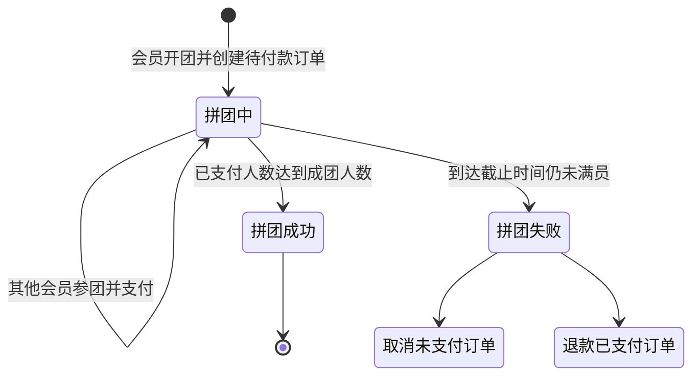

# 拼团模块产品设计说明

> 模块状态：服务端与 B 端已实现；C 端页面待接入

## 1. 模块定位、目标与非目标

拼团模块以单个商品规格为活动对象，支持会员按固定拼团价开团或参团，并根据已支付人数自动成团；超时未成团时取消未支付订单并退款已支付订单。

目标：

- 活动明确限定规格、价格、人数、时间和成团时限。
- 开团和参团均复用订单、库存和支付流程。
- 以已支付人数作为成团依据。
- 失败拼团自动补偿，避免会员资金和库存长期占用。

非目标：

- 不支持多规格组合、阶梯团价、团长优惠或虚拟成团。
- 拼团订单不叠加会员等级、优惠券或积分。
- 不包含分享素材、邀请奖励或独立售后规则。

## 2. 用户角色、场景与端侧范围

| 角色         | 使用场景                             | 当前支持                   |
| ------------ | ------------------------------------ | -------------------------- |
| 游客         | 浏览当前有效活动和可加入的团         | 能力已实现，C 端页面待接入 |
| 会员         | 发起拼团、加入拼团、支付并查看进度   | 能力已实现，C 端页面待接入 |
| 活动运营人员 | 配置活动、上下线、查看拼团记录和成员 | B 端已实现                 |

## 3. 核心业务对象与术语

- **拼团活动**：绑定一个销售规格，并配置拼团价、成团人数、活动期和每团时限。
- **拼团**：某会员在活动内发起的一次组团实例。
- **团长**：发起该拼团的会员，不享受额外价格或佣金。
- **参团成员**：团长或加入者与其拼团订单的关联记录。
- **占位人数**：待支付与已支付成员总数，用于防止超员。
- **已支付人数**：实际支付成功的成员数，是判断成团的唯一人数口径。

## 4. 功能清单

### 4.1 B 端活动管理

- 按名称和上线状态筛选活动。
- 新建和编辑活动名称、商品规格、拼团价、成团人数、活动时间、成团时限和状态。
- 上线或下线活动。
- 删除从未产生拼团记录的活动。

### 4.2 B 端拼团记录

- 按活动和拼团状态筛选拼团。
- 查看团 ID、活动、拼团价、人数进度、状态、截止时间和开团时间。
- 查看成员昵称、手机号、订单号、参团状态和支付时间。

### 4.3 C 端

- 游客查看当前上线且在活动期内的活动列表和详情。
- 查看活动商品、原规格售价、拼团价、人数要求、倒计时及最多 20 个可加入团。
- 已登录会员发起新团并获得待付款订单。
- 已登录会员加入仍有名额的团并获得待付款订单。
- 查看拼团状态和成员支付进度。

## 5. 关键用户流程

### 5.1 开团、参团与成团

1. 开团时创建拼团和团长的单件拼团订单，订单创建即扣减库存。
2. 参团时先确认拼团仍在进行、未过期、未满员且本人未参加过。
3. 待支付与已支付成员共同占用人数名额；取消待付款订单后释放名额。
4. 每个成员支付成功后更新为已支付。
5. 已支付人数达到目标时，拼团立即成功。
6. 拼团成功后，各成员订单继续按普通履约方式等待核销。

### 5.2 超时失败补偿

1. 拼团截止时间到达后仍未满足已支付人数，拼团转为失败。
2. 所有仍待支付的拼团订单由系统取消并回补库存。
3. 所有已支付成员执行原支付渠道整单退款，并回补库存和回退销量。
4. 补偿任务会持续核对遗漏的订单状态和未完成退款，支持安全重试。

## 6. 业务规则与状态

### 6.1 活动规则

- 一个活动只绑定一个当前可售规格。
- 拼团价必须大于 0 且低于该规格当前售价。
- 成团人数为 2–100 人。
- 单团成团时限为 1–10080 分钟。
- 活动结束时间必须晚于开始时间和当前时间。
- 同一规格的多个活动时间不能重叠。
- 实际拼团截止时间取“开团时间加成团时限”和“活动结束时间”中的较早者。
- 活动上线且当前时间位于活动期内，才允许开团。

### 6.2 活动修改与删除

- 活动产生拼团记录前，可修改全部有效配置。
- 产生拼团记录后，规格、拼团价、人数、成团时限和开始时间冻结，只能修改名称、结束时间和状态。
- 修改后的活动结束时间不能早于已有拼团的最晚截止时间。
- 已产生拼团记录的活动不能删除，可通过下线停止新开团。

### 6.3 拼团状态

| 状态   | 含义                             | 允许变化             |
| ------ | -------------------------------- | -------------------- |
| 拼团中 | 尚未达到已支付人数且未到截止时间 | 成功或失败           |
| 成功   | 已支付人数达到要求               | 终态                 |
| 失败   | 到期未成团                       | 终态，并执行订单补偿 |

### 6.4 成员状态

| 状态   | 含义                           |
| ------ | ------------------------------ |
| 待支付 | 已创建拼团订单并占用名额       |
| 已支付 | 支付成功，计入成团人数         |
| 已退款 | 拼团失败或允许的退款已经完成   |
| 已取消 | 待付款订单被取消，不再占用名额 |

## 7. 权限与数据可见范围

- 活动列表、活动详情和拼团基础详情为公开浏览能力。
- 开团和参团要求会员登录，会员身份由当前会话确定。
- 同一会员不能重复加入同一拼团。
- B 端活动维护和拼团记录查看由不同权限控制。
- C 端拼团详情不展示成员手机号和后台订单信息；B 端详情可展示。

## 8. 异常与边界场景

| 场景                        | 处理                           |
| --------------------------- | ------------------------------ |
| 活动未开始、已结束或已下线  | 不允许开团，C 端不列为有效活动 |
| 规格或商品不可售            | 拒绝创建或更新活动、拒绝开团   |
| 拼团价不低于规格售价        | 拒绝保存活动                   |
| 同规格活动时间重叠          | 拒绝保存                       |
| 会员重复加入同一团          | 拒绝并提示不能重复加入         |
| 拼团已满、成功、失败或过期  | 拒绝加入                       |
| 参团时库存不足              | 订单创建失败，不新增成员       |
| 支付结果或退款结果重复到达  | 不重复累计人数或重复退款       |
| 补偿过程中单笔取消/退款失败 | 记录异常并在后续补偿周期重试   |

## 9. 模块联动

- [商品模块](./02-product.md)提供活动规格、当前售价和库存。
- [订单模块](./04-order.md)创建固定拼团价订单、扣减与回补库存。
- [支付模块](./05-payment.md)提供成员支付与失败团退款。
- 拼团订单明确不使用[营销模块](./06-marketing.md)的等级、优惠券和积分。
- 拼团订单核销后仍可按[分销模块](./10-distribution.md)当前订单归因规则产生业绩。

## 10. 当前覆盖与已知缺口

| 能力                     | 服务端 | B 端         | C 端               |
| ------------------------ | ------ | ------------ | ------------------ |
| 活动配置与上下线         | 已实现 | 已接入       | 活动页待接入       |
| 开团、参团、状态查看     | 已实现 | 记录可查看   | 页面待接入         |
| 支付成团、超时取消与退款 | 已实现 | 可查看结果   | 支付联动页面待接入 |
| 定时补偿                 | 已实现 | 无人工控制页 | 无需独立页面       |

已知缺口：小程序拼团列表和详情仍为占位页面；分享拉新、团长权益和更复杂活动玩法不在当前基线。

## 11. 验收标准

- **Given** 有效双人团活动，**When** 团长和另一会员均支付成功，**Then** 已支付人数达到 2 且拼团转为成功。
- **Given** 拼团仅一人支付且到达截止时间，**When** 补偿任务执行，**Then** 拼团失败、已支付订单退款、待支付订单取消。
- **Given** 会员已加入某团，**When** 再次加入同一团，**Then** 操作被拒绝且不重复创建订单。
- **Given** 拼团待支付与已支付人数已经占满名额，**When** 新会员尝试加入，**Then** 系统提示人数已满。
- **Given** 活动已有拼团记录，**When** 运营人员修改规格或拼团价，**Then** 操作被拒绝并保留原活动规则。
