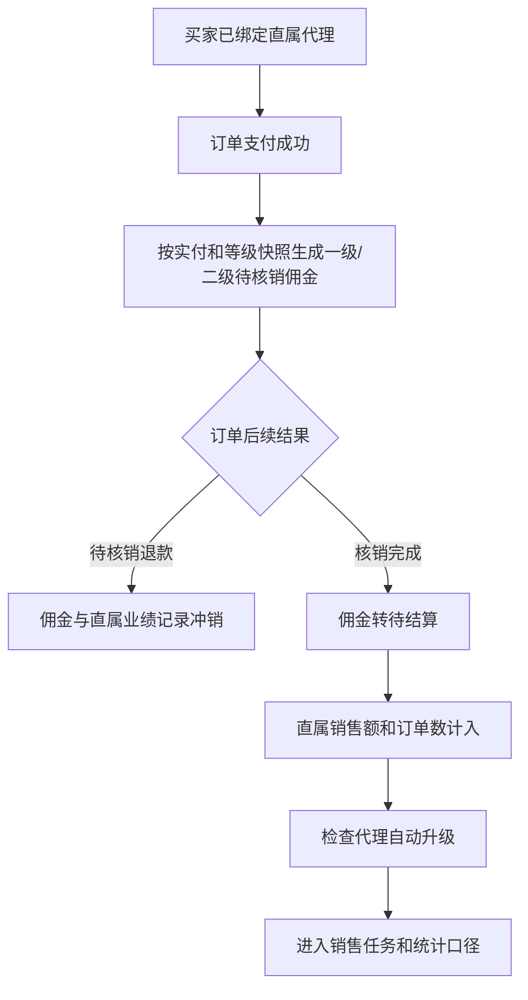
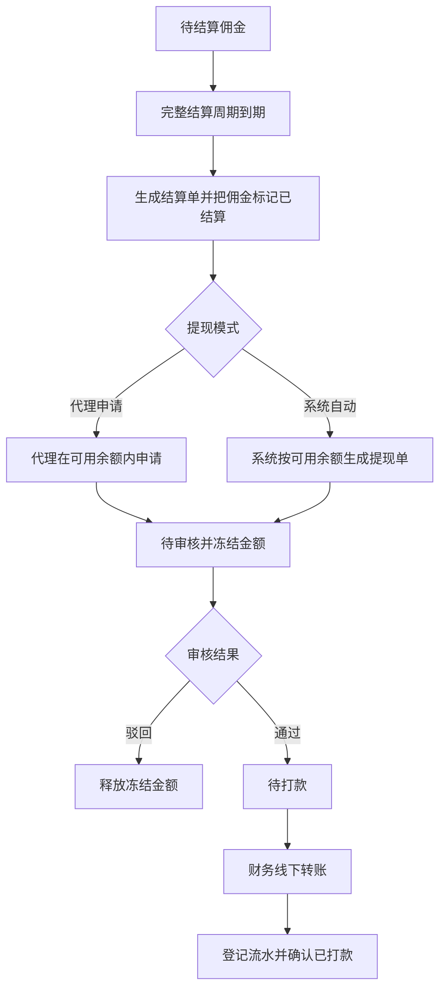

# 分销模块产品设计说明

> 模块状态：阶段 8A–8E 服务端与 B 端已实现；C 端能力已实现，小程序页面待接入

## 1. 模块定位、目标与非目标

分销模块管理代理商身份、推荐关系、佣金账本、结算提现、销售任务和销售统计，将订单支付与核销结果转化为可追溯的代理收益和直属业绩。

目标：

- 代理身份经过申请或后台创建，并由后台审核管理。
- 推荐关系只首次绑定，支付时按关系和等级快照生成佣金。
- 核销后佣金进入待结算并确认直属业绩，退款时正确冲销。
- 按完整周期结算佣金，提现必须审核并人工确认打款。
- 为代理配置销售任务，并提供统一的销售统计口径。

非目标：

- 不支持无限层级分销，当前最多两级佣金。
- 不支持任务奖励计算或自动发奖。
- 不支持自动调用微信转账；“已打款”由后台人员按真实转账结果确认。
- 素材中心、海报生成和社交分享工具不属于当前基线。

## 2. 用户角色、场景与端侧范围

| 角色         | 使用场景                                         | 当前支持                   |
| ------------ | ------------------------------------------------ | -------------------------- |
| 普通会员     | 申请代理、使用邀请码绑定推荐人                   | 能力已实现，C 端页面待接入 |
| 代理商       | 查看资料、佣金、团队、账户、提现、任务和直属业绩 | 能力已实现，C 端页面待接入 |
| 分销运营人员 | 维护类型、等级、代理、团队和任务                 | B 端已实现                 |
| 审核人员     | 审核代理申请和提现申请                           | B 端已实现                 |
| 财务人员     | 确认提现转账流水和打款结果                       | B 端已实现                 |
| 经营管理人员 | 查看全局、等级和代理销售统计并导出               | B 端已实现                 |

## 3. 核心业务对象与术语

- **代理类型**：代理商的业务分类，只包含名称、状态和排序。
- **分销等级**：定义等级顺序、升级门槛、分销深度和一、二级佣金比例。
- **代理商**：与一个会员绑定的分销身份，包含类型、等级、上级、邀请码和状态。
- **推荐关系**：普通会员与直属推荐代理之间的首次绑定关系。
- **一级佣金**：归属直属推荐代理的佣金。
- **二级佣金**：在等级允许两级分销时，归属直属代理上级的佣金。
- **直属有效销售额**：买家直属推荐代理名下、订单核销后确认的实付金额。
- **佣金账本**：记录每笔订单、受益代理、佣金层级、计算基数、比例快照、金额和状态。
- **结算单**：一个代理在一个完整结算周期内的待结算佣金汇总。
- **提现单**：代理申请或系统自动生成的提现记录，必须经过审核和打款确认。
- **销售任务**：按代理名单发布的销售额或订单数目标。

## 4. 功能清单

### 4.1 B 端基础配置与代理管理

- 维护代理类型的名称、排序和启停状态。
- 维护分销等级、升级销售额门槛、分销深度和一、二级佣金比例。
- 按姓名、手机号、状态、类型和等级查询代理。
- 后台创建代理，或审核会员提交的代理申请。
- 启用、禁用代理，人工调整等级和个人佣金比例。
- 查看代理详情、团队树、直属业绩和全部变更日志。

### 4.2 B 端佣金、结算与提现

- 按订单、代理、买家、佣金层级、状态和支付时间查询佣金。
- 配置周、月、季、年结算周期、结算日、提现模式和单笔上限。
- 手动执行已到期周期结算，查看结算记录。
- 按代理、来源、状态和时间查询提现单。
- 审核通过或驳回提现，并填写审核理由。
- 对审核通过的提现登记转账流水号并确认已打款。

### 4.3 B 端销售任务与统计

- 创建销售额或订单数任务，按全部代理、指定等级或指定代理分配。
- 发布任务、取消任务、删除草稿并查看代理完成进度。
- 查看全系统已核销销售额、订单数、分销直属销售额和产生业绩代理数。
- 查看时间趋势、当前等级统计、代理排名和代理个人趋势。
- 按当前时间范围导出销售趋势、代理业绩和等级统计。

### 4.4 C 端代理能力

- 提交代理申请并查看本人代理资料。
- 使用邀请码首次绑定直属推荐代理。
- 查看本人佣金明细和直属团队。
- 查看结算账户、可提现金额、冻结金额和历史提现单。
- 在代理申请提现模式下提交自定义金额提现。
- 查看分配给本人的销售任务及完成进度。
- 查看本人直属销售额、订单数、客户数和趋势。

## 5. 关键用户流程

### 5.1 代理申请与推荐关系

1. 会员选择启用的代理类型并提交真实姓名及联系信息。
2. 代理申请进入待审核。
3. 审核人员选择通过或驳回；通过时确认类型、等级和可选上级代理。
4. 通过后会员获得唯一邀请码和代理能力。
5. 普通会员可使用邀请码首次绑定直属推荐代理。
6. 关系产生佣金后冻结，后续交易继续沿用既有归属。

### 5.2 订单到佣金、业绩与升级

### 5.3 周期结算与提现

### 5.4 销售任务

1. 运营人员创建草稿，选择指标、目标、有效期和分配范围。
2. 发布时系统固定当次符合条件的已审核代理名单。
3. 任务按任务期内已核销直属销售额或直属订单数实时计算进度。
4. 达到目标即显示完成，进度最高显示 100%。
5. 已发布任务不可编辑，可取消；取消后停止新增业绩计入。

## 6. 业务规则与状态

### 6.1 类型、等级和代理

- 代理类型名称唯一；已被代理使用的类型不能删除。
- 分销等级的名称和等级顺序唯一；已被代理使用的等级不能删除。
- 分销深度只支持一级或二级，佣金比例使用万分比表达。
- 个人佣金比例为空时使用等级比例；设置后以个人比例为准。
- 自动升级按直属有效销售额选择满足门槛的最高更高等级，只升不自动降。
- 所有后台类型、等级、状态、上级、比例变更均记录变更前后值、原因和操作人。

### 6.2 代理状态

| 状态   | 含义                     | 产品行为                               |
| ------ | ------------------------ | -------------------------------------- |
| 待审核 | 会员已提交申请           | 等待后台审核，不具备有效代理能力       |
| 已通过 | 审核通过并可正常开展分销 | 可产生佣金、查看任务和申请提现         |
| 已驳回 | 申请未通过               | 保留审核理由，可重新按后续规则处理     |
| 已禁用 | 已通过代理被暂停         | 不再作为正常分销账号使用，历史账本保留 |

### 6.3 推荐与佣金规则

- 一个会员只能首次绑定一个直属推荐代理，不能通过重复提交更换。
- 推荐关系不能形成自我推荐或循环层级。
- 订单支付成功时，以订单实付金额作为佣金基数，并保存当时等级、比例和关系快照。
- 仅在直属代理有效且等级允许时生成一级佣金；二级佣金还要求存在有效上级且分销深度为二级。
- 佣金金额向下取整到分。
- 同一订单、受益代理和佣金层级只生成一条账本记录，重复支付结果不重复记账。

### 6.4 佣金状态

| 状态   | 触发条件           | 后续动作             |
| ------ | ------------------ | -------------------- |
| 待核销 | 订单支付成功       | 等待订单核销或退款   |
| 待结算 | 订单核销完成       | 等待完整结算周期到期 |
| 已冲销 | 待核销订单完成退款 | 不再结算             |
| 已结算 | 已进入结算单       | 计入代理结算账户     |

### 6.5 结算与提现规则

- 结算周期支持自然周、自然月、自然季度和自然年。
- 结算日为 1–28；周结时只允许星期一至星期日。
- 只结算已经完整结束且到达结算日的周期，不结算当前未完周期。
- 相同代理、分润类型和周期只生成一张结算单，重复执行不会重复结算。
- 提现模式分为代理申请和系统自动，两种模式生成的提现单都必须人工审核。
- 提现金额必须大于 0，不得超过可用余额和单笔提现上限。
- 已禁用代理不再产生新的正常分销业务，但仍可提取历史已结算余额。
- 待审核和待打款金额均冻结；驳回后释放，确认打款后计入已支付。
- 结算单与提现单均不可编辑或删除。

### 6.6 提现状态

| 状态   | 允许动作                     |
| ------ | ---------------------------- |
| 待审核 | 审核通过或驳回               |
| 待打款 | 登记真实转账流水并确认已打款 |
| 已驳回 | 终态，金额已释放             |
| 已打款 | 终态，金额已支付             |

### 6.7 任务状态与统计口径

| 状态   | 含义                   |
| ------ | ---------------------- |
| 草稿   | 可编辑、删除和发布     |
| 未开始 | 已发布但未到开始时间   |
| 进行中 | 已发布且位于任务有效期 |
| 已结束 | 已超过任务结束时间     |
| 已取消 | 已发布任务被人工取消   |

- 发布时若开始时间已经过去，会从发布时间开始计算。
- 任务分配范围为全部已审核代理、指定等级的已审核代理或指定已审核代理。
- 发布后名单固定，代理后续等级变化不改变任务归属。
- 指标只统计任务有效期内已核销的直属销售额或直属订单数，不统计团队间接业绩。
- 当前任务只记录目标和进度，不设置奖励。

### 6.8 销售统计口径

- 全系统销售额和订单数只统计已核销并完成的订单，以核销时间归属统计周期。
- 分销直属销售额、订单数和客户数只统计已确认的直属业绩，以确认时间归属周期。
- 客户数按买家会员去重。
- 默认统计本月 1 日至当天；开始和结束日期必须同时填写，最长跨度 5 年。
- 31 天内按日、366 天内按月、更长范围按年展示趋势，无数据周期补 0。
- 等级统计按代理当前等级归类，不回溯历史等级。

## 7. 权限与数据可见范围

- C 端会员只能查看本人的代理资料、佣金、账户、提现、任务和业绩。
- 非代理会员查看代理专属数据时返回空结果或提示代理不存在，不暴露他人信息。
- B 端类型、等级、代理、佣金、结算、提现、任务、统计和导出分别受权限控制。
- 提现审核人与打款确认人均记录后台用户身份。
- C 端销售统计只返回汇总和趋势，不返回具体订单或客户明细。

## 8. 异常与边界场景

| 场景                            | 处理                                 |
| ------------------------------- | ------------------------------------ |
| 重复提交代理申请或邀请码绑定    | 按当前身份或既有关系拒绝重复操作     |
| 邀请码无效、代理未通过或已禁用  | 不建立推荐关系                       |
| 推荐关系形成自我或循环关系      | 拒绝绑定或调整                       |
| 重复支付、核销或退款结果        | 不重复生成、确认或冲销佣金和业绩     |
| 核销完成后尝试退款              | 订单规则拒绝，不冲销已确认业绩       |
| 重复执行同一结算周期            | 已结算记录保持不变，不重复生成结算单 |
| 提现金额超过余额或单笔上限      | 拒绝创建提现单                       |
| 非当前提现模式提交申请          | 拒绝并提示当前模式                   |
| 对非待审核提现重复审核          | 相同结果安全返回，冲突状态拒绝       |
| 发布任务时没有符合条件的代理    | 拒绝发布                             |
| 查询日期不完整、倒置或超过 5 年 | 拒绝查询并提示时间范围错误           |

## 9. 模块联动

- [会员模块](./01-member.md)提供申请人、代理与买家身份。
- [订单模块](./04-order.md)提供支付、核销、完成和退款事件。
- [支付模块](./05-payment.md)保证支付与退款结果可靠、幂等。
- [经营看板](./11-dashboard.md)汇总代理审核、提现审核、待打款等运营待办。
- 系统权限和操作日志为分销后台操作提供授权与审计。

## 10. 当前覆盖与已知缺口

| 能力                   | 服务端 | B 端   | C 端               |
| ---------------------- | ------ | ------ | ------------------ |
| 类型、等级、代理、团队 | 已实现 | 已接入 | 页面待接入         |
| 推荐关系与佣金账本     | 已实现 | 已接入 | 页面待接入         |
| 周期结算与提现         | 已实现 | 已接入 | 钱包与提现页待接入 |
| 销售任务               | 已实现 | 已接入 | 任务页待接入       |
| 销售统计与导出         | 已实现 | 已接入 | 本人统计页待接入   |

已知缺口：小程序分享中心、佣金、团队、钱包、提现和任务页面仍为占位；素材中心不属于已实现范围；自动微信转账和任务奖励均未实现。

## 11. 验收标准

- **Given** 会员提交完整代理申请，**When** 后台审核通过并指定有效类型和等级，**Then** 会员获得已通过代理身份和唯一邀请码。
- **Given** 买家已绑定有效直属代理，**When** 订单支付成功，**Then** 按实付和等级快照生成唯一待核销佣金记录。
- **Given** 待核销订单退款成功，**When** 分销结果同步，**Then** 对应佣金和直属业绩记录转为冲销且不进入结算。
- **Given** 订单核销完成，**When** 处理分销业绩，**Then** 佣金转待结算、直属销售额增加并检查自动升级。
- **Given** 一个完整结算周期已经到期，**When** 重复执行结算，**Then** 首次生成结算单，后续执行不重复结算。
- **Given** 代理可用余额充足，**When** 申请提现并经审核、打款确认，**Then** 金额依次冻结并转入已支付，且记录审核人与转账流水。
- **Given** 已发布任务名单包含某代理，**When** 该代理在任务期内产生已核销直属订单，**Then** 任务进度按指定指标实时增加。
