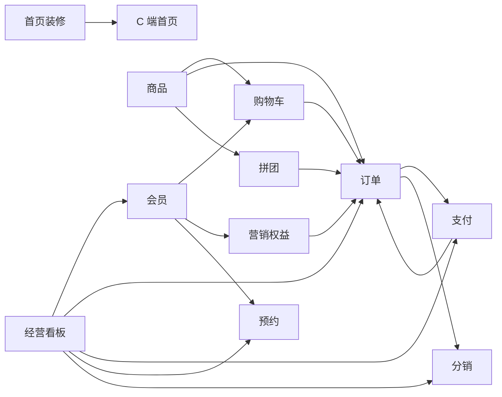

# 悦己 DLumière 核心业务产品设计说明

> 文档状态：当前实现基线  
> 核对日期：2026-08-25  
> 适用对象：产品、研发、测试、运营及后续项目接手人员

## 1. 文档定位

本目录描述悦己 DLumière 当前已经落地的核心产品行为，并明确标出已经确认但尚未接入的能力。文档以用户、运营人员和业务流程为中心，不描述接口、数据表、类或代码实现。

阅读时需区分两种状态：

- **已实现**：服务端已有完整业务能力；文档会进一步说明管理端或小程序是否已经接入。
- **已知缺口**：仓库计划或三端现状已经明确尚未完成的部分，不代表已经承诺具体上线时间。

本套文档不设计新的目标态功能。未来新增业务规则时，应先更新对应模块文档，再进入实现。

## 2. 系统角色与端侧

| 角色          | 说明                                                                 | 主要端侧     |
| ------------- | -------------------------------------------------------------------- | ------------ |
| 游客          | 未登录的小程序访问者，可浏览公开商品、装修内容和进行中的拼团活动     | C 端小程序   |
| 会员          | 通过微信身份登录的消费者，拥有独立资料、购物车、订单、权益和预约记录 | C 端小程序   |
| 代理商        | 已通过审核的会员，可发展推荐关系、查看佣金、提现、任务和直属业绩     | C 端小程序   |
| 运营人员      | 维护商品、会员、营销、预约、装修、拼团、分销和经营数据               | B 端管理后台 |
| 核销人员      | 拥有订单核销权限的后台用户                                           | B 端管理后台 |
| 财务/审核人员 | 拥有退款、提现审核或打款确认权限的后台用户                           | B 端管理后台 |

文档中的“B 端”指管理后台，“C 端”指微信小程序及其会员业务能力。

## 3. 模块导航

| 序号 | 模块                           | 说明                                           | 当前端侧状态                                     |
| ---- | ------------------------------ | ---------------------------------------------- | ------------------------------------------------ |
| 01   | [会员](./01-member.md)         | 会员资料、标签、备注和 360° 视图               | B 端已接入；C 端能力已实现、页面待接入           |
| 02   | [商品](./02-product.md)        | 分类、商品、规格、库存和商品浏览               | B/C 端均已接入商品浏览与管理                     |
| 03   | [购物车](./03-cart.md)         | 加购、数量、选中、失效和结算衔接               | C 端能力已实现、页面待接入                       |
| 04   | [订单](./04-order.md)          | 试算、下单、取消、支付后核销和退款后的订单状态 | B 端已接入；C 端页面待接入                       |
| 05   | [支付](./05-payment.md)        | 支付单、模拟支付、支付查询和整单退款           | B 端退款已接入；真实微信支付和 C 端页面待接入    |
| 06   | [营销](./06-marketing.md)      | 会员等级、积分和优惠券                         | B 端已接入；C 端页面待接入                       |
| 07   | [预约](./07-appointment.md)    | 最简日期、时间预约                             | B 端已接入；C 端页面待接入                       |
| 08   | [首页装修](./08-decoration.md) | Banner、公告和品牌背书                         | B 端已接入；C 端首页待接入                       |
| 09   | [拼团](./09-group-buy.md)      | 拼团活动、开团、参团、成团和失败退款           | B 端已接入；C 端页面待接入                       |
| 10   | [分销](./10-distribution.md)   | 代理、推荐、佣金、结算、提现、任务和销售统计   | B 端已接入；C 端页面待接入                       |
| 11   | [经营看板](./11-dashboard.md)  | 访问、会员、待办和系统动态                     | B 端已接入；C 端上报能力已具备，初始化接线待确认 |

## 4. 模块关系

认证、权限、文件上传、实时在线状态和公共配置属于支撑能力：它们为核心模块提供登录身份、操作授权、素材保存、后台在线人数和可调整规则，但不单独形成产品域文档。

## 5. 统一业务口径

- 金额均表示人民币，业务计算以“分”为最小单位，页面统一换算为“元”展示。
- C 端会员只能读取和操作本人数据；B 端操作由具体权限控制。
- 商品价格、优惠金额、积分抵扣、佣金和结算金额均由系统计算，端侧展示值不能作为最终业务依据。
- 删除通常表示业务侧不可再见；已产生交易或记录的数据优先保留历史快照，不因当前配置修改而重写。
- 订单生命周期以[订单文档](./04-order.md)为准。
- 支付与退款结果以[支付文档](./05-payment.md)为准。
- 会员等级、积分和优惠券以[营销文档](./06-marketing.md)为准。
- 拼团状态以[拼团文档](./09-group-buy.md)为准。
- 代理佣金、结算和提现以[分销文档](./10-distribution.md)为准。

## 6. 当前交付边界

- 管理后台的阶段 1–8E 核心业务页面已经完成。
- 小程序已完成商品中心；访问上报工具已经存在但初始化接线待确认，购物车、订单、支付结果、个人中心、营销权益、预约、首页装修、拼团和分销页面仍待接入现有能力。
- 当前支付使用开发联调能力；真实微信支付配置、回调、UAT 和上线属于后续阶段。
- 大转盘、积分商城、兑换码、送礼、代付、素材中心等扩展能力不属于本套当前产品基线。
