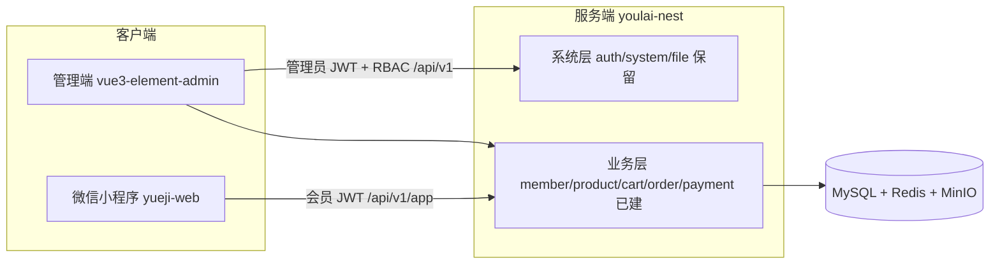

# 悦己 DLumière 医美小程序 — 系统改造计划

> 总计划。阶段编号三端共用。换工具 / 换对话后从本文「当前进度」接着做。
>
> 配套前端计划：
> - 管理端 `E:\CODE\vue3-element-admin\docs\改造计划.md`
> - 小程序 `E:\CODE\yueji-web\docs\改造计划.md`

## 当前进度（2026-08-17）

**已完成：阶段 0、1、2；阶段 3、4 服务端 + 管理端已完成。小程序待一次性接入阶段 3/4。**

| 阶段 | 状态 | 说明 |
|------|------|------|
| 0 环境与约定 | 已完成 | Docker MySQL/Redis/MinIO、本地 `.env.dev`、Swagger B/C 拆分 |
| 1 会员体系 | 已完成 | 独立 `member`、C 端登录/鉴权、P0 建表 SQL |
| 2 商品域 | 已完成 | 服务端 product 模块 + 管理端商品页 + 小程序产品中心 |
| 3 购物车/订单/核销 | **服务端+管理端已完成** | 小程序本阶段暂不改，后续一次性接入 |
| 4 支付抽象 + 个人中心 | **服务端+管理端已完成** | 小程序支付结果与个人中心待一次性接入 |
| 5 等级/积分/优惠券 | 未开始 | |
| 6 医生预约 | 未开始 | |
| 7 首页装修 + 拼团 | 未开始 | |
| 8 分销 + 统计 | 未开始 | |
| 9 联调/真实支付/上线 | 未开始 | |

三端仓库：

| 角色 | 路径 | 分支（写计划时） |
|------|------|------------------|
| 服务端（本仓库） | `E:\CODE\youlai-nest` | `cursor/phase0-docker-env-setup-e2b3` |
| 管理端 | `E:\CODE\vue3-element-admin` | `master` |
| 小程序 | `E:\CODE\yueji-web` | `main`（阶段 2 页面改动可能尚未提交） |

---

## 总体架构



**核心原则**

1. 每个阶段做到「服务端接口可用 → 管理端能配置 → 小程序能使用」再进入下一阶段。
2. 阶段内顺序：服务端（Swagger 自测）→ 管理端（录入真实数据）→ 小程序（真实数据联调）。不三端交叉开发。
3. 模板系统层（`src/auth` 管理端登录、`src/system`、`src/file`）不改核心逻辑；业务模块全部新建。
4. 金额一律整数「分」存储；表继承模板审计字段（`create_time` / `update_time` / `is_deleted`）。
5. C 端用户是 `member`，B 端用户是 `sys_user`，两套 JWT，互不可用。

---

## 已落地的约定（后续必须遵守）

### 接口与文档

- 全局前缀：`/api/v1`
- B 端：`/api/v1/<资源>`，Swagger：`http://localhost:8000/api-docs`
- C 端：`/api/v1/app/<资源>`，Swagger：`http://localhost:8000/app-api-docs`
- 统一响应：`{ code: "00000", msg, data }`；分页 `data: { list, total }`
- C 端接口用 `@Public()` + `@MemberAuth()`（需要登录时）；浏览类商品接口可不登录

### 鉴权

- 管理员 JWT：现有 `JwtAuthGuard` + RBAC
- 会员 JWT payload：`{ typ: "member", sub: memberId }`
- 守卫：`src/common/guards/member-jwt.guard.ts`
- 装饰器：`@MemberAuth()`、`@CurrentMember()`
- 开发联调：`POST /api/v1/app/auth/mock-login`（无需真实微信 AppId）

### 本地环境

- Docker：`docker/docker-compose.yml`（MySQL 8 / Redis / MinIO），说明见 `docker/README.md`
- 配置：`.env.dev`（指向本地 Docker，勿改回官方只读库）
- 后端：`pnpm start:dev` → `http://localhost:8000`
- 管理端：`.env.development` 的 `VITE_APP_API_URL=http://localhost:8000`，`pnpm dev` → `http://localhost:3000`，账号 `admin` / `123456`
- 小程序：`.env.development` 的 `VITE_API_BASE_URL=http://localhost:8000`，`VITE_USE_MOCK=false`

### SQL

| 文件 | 用途 |
|------|------|
| `sql/mysql/youlai_admin.sql` | 模板系统表（首次 Docker 自动导入） |
| `sql/mysql/biz_p0.sql` | P0 业务表：member / product* / cart / biz_order* |
| `sql/mysql/biz_phase4.sql` | 阶段 4 增量：payment / refund、会员字段、退款权限 |
| `sql/mysql/menu_product.sql` | 商品管理菜单 + ROOT/ADMIN 授权 |
| `sql/mysql/menu_member.sql` | 会员管理菜单 + ROOT/ADMIN 授权 |

导入业务 SQL（PowerShell 勿直接管道，用 `docker cp` 再在容器内执行）：

```bash
docker cp sql/mysql/biz_p0.sql youlai-nest-mysql:/tmp/biz_p0.sql
docker exec youlai-nest-mysql sh -c "mysql -uroot -p123456 --default-character-set=utf8mb4 < /tmp/biz_p0.sql"
```

---

## 已完成阶段摘要

### 阶段 0：基础准备

- Docker 用 MySQL 替换原模板 MongoDB；Redis、MinIO 保留
- `.env.dev` 切到本地
- Swagger 拆成 B/C 两套文档
- 管理端代理指向本地后端

### 阶段 1：会员体系 + P0 表

- `src/member`：实体、Service、B 端列表/详情、C 端 profile
- `src/auth/app/`：`silent-login` / `phone-login` / `mock-login`，删除旧 `wxma-auth`（绑 `sys_user`）
- `MemberJwtGuard`；全局管理员守卫对 `MEMBER_API` 元数据放行
- `JwtModule` 设为 `global: true`

关键接口：

- `POST /api/v1/app/auth/mock-login`
- `GET/PUT /api/v1/app/member/profile`
- `GET /api/v1/members/page`、`GET /api/v1/members/:id`

### 阶段 2：商品域

服务端 `src/product`：

- 三级分类树（最多 3 级；有子分类或商品时不可删；有子分类时不可改父级）
- 商品 SPU + 多 SKU：创建/更新走事务；SPU 现售价 = 最低启用 SKU 价；库存 = 启用 SKU 之和
- 金额单位：分

| 端 | 路径 |
|----|------|
| B 分类 | `/api/v1/product-categories`（tree / POST / PUT / DELETE） |
| B 商品 | `/api/v1/products`（page / :id/form / POST / PUT / PATCH :id/status / DELETE） |
| C 浏览 | `/api/v1/app/product/categories`、`/page`、`/:id`（无需登录） |

管理端：`src/api/product/`、`src/views/product/category/`、`src/views/product/goods/`（列表 + 抽屉编辑，元转分）。

小程序：产品中心 Tab、搜索、列表、详情；`src/api/product` 做字段映射（`mainImage→cover` 等）；加购/购买按钮暂提示「即将上线」。

---

## 阶段 3：购物车 + 订单 + 核销（服务端+管理端已完成，小程序待补）

> 本阶段是全计划地基。做完后阶段 5 只往计价管道加处理器，不重构订单。

### 服务端（先做）

- `src/cart`：会员购物车增删改查、按 SKU 合并数量
- `src/order`：创建订单（扣库存）、状态机、核销码、查询
- **订单状态**：待付款 → 已付款/待核销 → 已核销 → 已完成；以及已取消
- **计价管道**：商品总额 → 会员折扣 → 优惠券 → 积分抵扣 → 实付。本阶段后三步返回 0，接口形状先定死
- **领域事件**：引入 `@nestjs/event-emitter`，发 `order.paid` / `order.completed` 等；后续积分/佣金只订阅
- **最小 Mock 支付**：模拟支付成功，推进状态机（阶段 4 再抽成支付驱动）
- **超时取消**：`@nestjs/schedule`，待付款超时自动取消并回补库存
- **测试底线**：计价管道 + 状态机写 jest 单测

表已在 `biz_p0.sql`：`cart`、`biz_order`、`biz_order_item`。先读表结构再写实体，不要另起一套字段。

### 管理端（服务端自测通过后）

- 订单列表/详情、手动核销、Excel 导出（模板已有 exceljs）
- 菜单 SQL 参照 `sql/mysql/menu_product.sql` 风格，授权 ROOT + ADMIN（`admin` 用户 role_id=2，不是 ROOT）

### 小程序（管理端能录单后）

- 购物车页、订单确认、我的订单列表/详情
- 详情页「加入购物车 / 立即购买」接到真实接口

### 本阶段不做

- 真实微信支付（阶段 9）
- 优惠券/积分实际抵扣（阶段 5，只留管道空位）
- 个人中心完整版（阶段 4）

---

## 阶段 4：支付抽象 + 个人中心（服务端+管理端已完成，小程序待补）

- `src/payment`：统一支付驱动（创建/查询/确认回调/退款），默认 Mock，预留 WeChat 占位
- 整单退款：仅已付款待核销订单，事务内退款、回补库存、回退销量，订单进入已退款
- 会员 360：资料、订单统计、最近 10 单；支持标签和备注维护
- 管理端：会员列表/360 视图、订单退款操作已完成
- 小程序：支付结果页、个人中心（头像昵称、订单入口）待后续与阶段 3 一次性接入
- **里程碑：浏览 → 加购 → 下单 → 模拟支付 → 核销**

---

## 后续阶段（未开始，保持原计划）

### 阶段 5：会员等级 + 积分 + 优惠券

- 等级折扣 / 积分 / 优惠券接入已有计价管道
- 管理端：等级、积分规则、优惠券
- 小程序：会员中心、积分、优惠券、下单选券

### 阶段 6：医生预约

- `src/doctor` + `src/appointment`：医生、SKU 预约间隔、日历、改期/取消

### 阶段 7：首页装修 + 拼团

- 本阶段再建 `banner` 等装修表（不要提前建）
- 拼团超时失败退款复用 schedule + 支付退款接口

### 阶段 8：分销基础 + 数据统计

- 代理商、二级关系、佣金、提现；销售/订单/消费统计

### 阶段 9：联调 + 真实支付 + 上线

- 替换 Mock 支付驱动；UAT；部署；小程序提审

P2（大转盘、积分商城、分销完整版、素材库、限时折扣、送礼/代付）不在本计划。

---

## 换对话后怎么接着做

1. 读本文「当前进度」：阶段 3/4 服务端和管理端已完成，小程序待补。
2. 小程序一次性接入：购物车、订单确认、我的订单、模拟支付、支付结果和个人中心。
3. 阶段内仍遵守：服务端 → 管理端 → 小程序。
4. 每阶段验收通过再提交；不要把 Docker 数据目录、`.env` 密钥提交进 Git。
